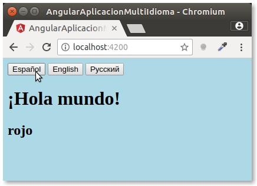
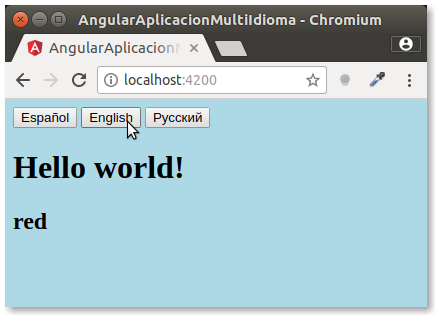
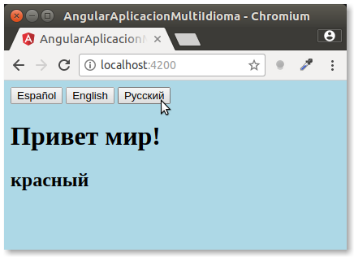

# Multi-language simple application in Angular 4

Very simple multi-language application. Translation is done with a pipe: `{{ '¡Hola mundo!' | translate }}`. Base language in this application is Spanish (all the texts are translated from Spanish into English and Russian) but it can be set to English or any other language very easily.

## Screenshots

